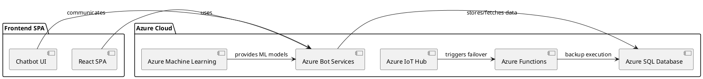

Great, we'll incorporate React for the SPA and Azure services for intent analysis into our plan. The inclusion of a failover node implemented as an Azure Function is also noted. Let's outline the Method section, detailing the technical architecture, which includes database schemas, algorithms, component diagrams, and more.

Method
Architecture Overview
The system will be built on a microservices architecture, utilizing Azure services for scalability and reliability. Below are the key components and their interactions:

Chatbot: Implemented using React for the frontend interface and Azure Bot Services for the backend. The chatbot will utilize Azure's Language Understanding (LUIS) for intent analysis to replace the retired LIUI system.
Single-Page Application (SPA): Built with React, the SPA will serve as the partner portal for managing automation tasks, monitoring executions, and configuring system settings.
Failover Mechanism: An Azure Function will act as the activity node, ensuring that the system remains operational even if the primary execution environment fails.
API Layer: Secure RESTful APIs will facilitate communication between the frontend, the chatbot, and other system components.
IoT Hub: Used for managing connections and secure communications between the distributed agents and the central system.
Database Schema
The database will support the storage needs for configurations, user data, and logging of automation tasks. A relational database like Azure SQL Database will be used with the following schema:

Users: Stores user credentials and roles.
Configurations: Contains all automation and chatbot configurations.
Logs: Audit logs for actions performed through the chatbot and SPA.
Tasks: Details of each automation task, including status and outcome.
Algorithms
Ticket Classification and Routing: Utilizes a supervised machine learning model hosted on Azure Machine Learning to classify tickets and determine the appropriate routing based on historical data.
Package Execution Decision: Algorithms to decide when and where to execute packages based on system load, priority, and resource availability.
Component Diagram
Here’s a high-level component diagram using PlantUML:

Next Steps
Please review the outlined technical method for accuracy and completeness. If this aligns with your expectations, we can proceed to detail the implementation steps, including the development phases, technologies to be used, and deployment strategies. If there are additional components or specific technologies you would like to incorporate, please let me know.
